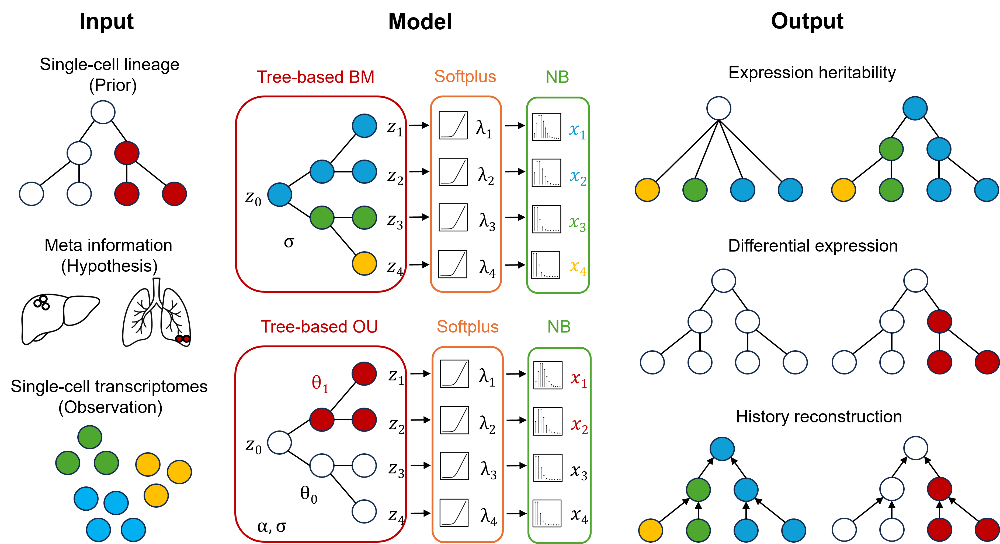

# LaVOUS

LaVOUS (Lineage-aware Variational Ornstein-Uhlenbeck Stochastics)
is a lineage-aware variational model for single-cell RNA-seq count data.
It models latent expression on a cell-lineage tree with Brownian motion (BM) or
Ornstein-Uhlenbeck (OU) dynamics, maps latent expression through a softplus link,
and evaluates observed counts with a negative-binomial observation model.




The package implements three analysis workflows:

1. **Expression heritability**: tests whether expression follows lineage
   structure using a likelihood-ratio test between a BM model with Pagel's
   lambda fixed at 0 and a BM model with free Pagel's lambda.
2. **Differential expression**: tests whether expression shifts across regimes
   on the tree using an OU likelihood-ratio test between one shared theta and
   multiple regime-specific theta values. Empirical-null calibration can be run
   separately from the fitted null model.
3. **History reconstruction**: reconstructs latent expression histories on the
   lineage tree using fitted OU/BM parameters and variational leaf beliefs.

The source files are in `source/`.

## Installation

Install locally from the repository root:

```bash
pip install -e .
```

The installed command-line tools use the `lavous-*` names shown below.

## Inputs

The workflows use the following inputs as applicable:

- `--tree`: Newick lineage tree. Leaf names must match expression-matrix rows.
- `--expression`: raw read-count matrix with cells as rows and genes
  as columns. Do not log-transform counts.
- `--regime`: node-to-regime labels for OU workflows. Two formats are accepted:
  `node_name,regime` for named tree nodes, or `node,node2,regime` where a node is
  represented by the MRCA of one or two leaves.
- `--null`: regime label used as the null/background regime for OU tests.
- `--null_regime`: optional node-to-regime file defining a coarser,
  multi-theta null model. It uses the same format as `--regime` and is only
  used by `lavous-diff`.
- `--library`: optional headerless, two-column TSV containing a cell name and
  library-size factor on each row.

Optionally, the heritability and differential-expression workflows accept matching
comma-separated file lists for multi-clone analyses. Supply one path per tree
for each applicable file option, including `--null_regime` when it is used.
The code aligns cells to tree leaves by name during preprocessing.


## Outputs

The expression-heritability test writes the TSV supplied to `--outfile`. It contains one row per gene with the BM likelihood-ratio statistic, p-value, q-value, and fitted lambda and variance parameters.

The differential-expression workflow writes:

- `{prefix}_chi-squared.tsv`: fitted parameters, losses, LR statistic, p-value,
  q-value, and significance indicator.
- `{prefix}_model-params.tsv`: long-form fitted OU parameters with one row per
  gene, hypothesis, and regime. This is the preferred parameter file for
  calibration diagnostics and reconstruction.
- `{prefix}_meta.json`: run metadata needed for empirical-null calibration.
- `{prefix}_h0_q-mean-std_*.tsv` and `{prefix}_h1_q-mean-std_*.tsv`:
  variational leaf means and standard deviations. Columns are named
  `q_mean_{cell}` and `q_std_{cell}`.

The calibration writes:
- `{prefix}_empirical-all.tsv` for shared null simulations (`--sim_all`).
- `{prefix}_empirical-each.tsv` for per-gene null simulations (`--sim_each`).

History reconstruction writes the paths supplied to `--out_tsv` and `--out_fig`: a tab-separated table of reconstructed ancestral states and an optional tree figure.

Simulation writes the read-count matrix named by `--label` under `--out` (for example, `readcounts_demo.tsv`).

## Quick Start

Run the examples from the repository root after installation. Optionally, create
a different output directory so the commands can be run in order without
overwriting the examples.

### Expression Heritability

```bash
lavous-heritability \
  --tree examples/input_data/tree_demo.nwk \
  --expression examples/input_data/readcounts_demo.tsv \
  --outfile examples/output_results/heritability.tsv
```

This workflow fits BM/NB models under lambda=0 and free lambda and reports the
likelihood-ratio statistic, p-value, Benjamini-Hochberg q-value, and fitted BM
parameters.

### Differential Expression

```bash
lavous-diff \
  --tree examples/input_data/tree_demo.nwk \
  --expression examples/input_data/readcounts_demo.tsv \
  --regime examples/input_data/regime_demo.csv \
  --null 0 \
  --outdir examples/output_results \
  --prefix diff
```

By default, `lavous-diff` compares the alternative regime partition against an
H0 with one shared theta. Pass `--null_regime PATH` to compare it against a
coarser multi-theta H0 instead.

The result table reports `lrt = 2 * (h0_loss - h1_loss)`.
Chi-squared p-values are computed from `lrt`; empirical
calibration compares simulated and observed `(h0_loss - h1_loss)`.

### Empirical-Null Calibration

After running the differential-expression test, optionally calibrate p-values from null
simulations:

```bash
lavous-calibrate \
  --chi examples/output_results/diff_chi-squared.tsv \
  --sim_all 1000
```

Use `--sim_each N` for per-gene null simulations. This is much more expensive
because it refits the LRT to `N` simulated datasets per gene.

### History Reconstruction

```bash
lavous-reconstruct \
  --tree examples/input_data/tree_demo.nwk \
  --q_params examples/output_results/diff_h1_q-mean-std_0.tsv \
  --read_counts examples/input_data/readcounts_demo.tsv \
  --gene Gene_2 \
  --model ou \
  --regime examples/input_data/regime_demo.csv \
  --ou examples/output_results/diff_model-params.tsv \
  --out_tsv examples/output_results/history_gene2.tsv \
  --out_fig examples/output_results/history_gene2.png
```

The `--q_params` input for reconstruction should contain leaf-level variational
beliefs, such as the wide q-parameter files written automatically by
`lavous-diff`. Reconstruction normalizes tree branch lengths by default to
match the fitted OU/BM model scale; use
`--no_normalize_tree` only for parameters fitted on raw branch lengths.

### Stochastic Simulation (Optional)

To generate a small simulated read-count matrix from a tree and regime file:

```bash
lavous-simulate \
  --tree examples/input_data/tree_demo.nwk \
  --regime examples/input_data/regime_demo.csv \
  --test 1 \
  --background 1 \
  --n_genes 5 \
  --sigma 3 \
  --optim 3 \
  --alpha 1 \
  --dispersion 5 \
  --out examples/input_data \
  --label demo
```

This writes simulation `examples/input_data/readcounts_demo.tsv`.

## Source Layout

- `preprocess.py`: tree, count, library-size, and regime preprocessing.
- `likelihood.py`: Gaussian BM/OU tree likelihoods.
- `approx.py`: softplus/exp moment approximations used by the ELBO.
- `elbo.py`: variational objective for latent expression and count likelihoods.
- `optimize.py`: PyTorch and SciPy optimization routines.
- `plasticity.py`: expression-heritability LRT CLI.
- `ou_diff.py`: differential-expression LRT CLI.
- `calibrate.py`: empirical-null calibration CLI.
- `reconstruct.py`: Gaussian belief propagation for history reconstruction.
- `stochas_sim.py` and `simulate.py`: simulation utilities.

More detailed developer notes are in `docs/source_map.md`.

Larger real-data, simulation, and publication-figure workflows are grouped
under `analysis/`.


## Citation
The accompanying preprint is available on [bioRxiv](https://www.biorxiv.org/content/10.64898/2026.06.25.734628v1):

Xing J, Staklinski SJ, Liu Z, Nowak D, Siepel A. Lineage-aware stochastic modeling reveals gene-expression dynamics in development and disease. <i>bioRxiv</i>. doi:10.64898/2026.06.25.734628.
